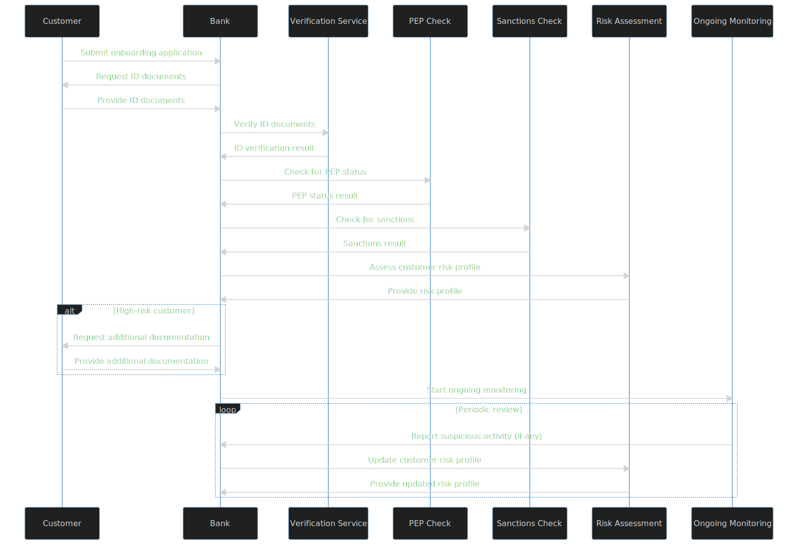

# KYC Application Architecture

## Getting Started

To implement the KYC process in Python, we will need to set up the development environment with the required tools and libraries. This includes:

- Python 3.10 or later: Download and install the latest version of Python from https://www.python.org/downloads/.
- Virtual Environment: Create a virtual environment to manage dependencies, using `python -m venv venv` and activate it.
- Dependency Management: Use `pip` to install and manage required packages, such as Django, Flask, or FastAPI for web development, and other necessary libraries for data processing and integration with backing services.

## Owners

The owners are responsible for overseeing the development and maintenance of the KYC application. This includes:

- Project Manager: Responsible for project planning, resource allocation, and communication with stakeholders.
- Technical Lead: Responsible for making architectural decisions, providing guidance to the development team, and ensuring code quality and performance.
- Development Team: Responsible for implementing the application components, writing tests, and fixing bugs.
- Quality Assurance Team: Responsible for testing the application, reporting issues, and validating fixes.

## Front End

The front end is responsible for presenting the user interface and interacting with users. Key components include:

- UI Framework: Choose a UI framework, such as Bootstrap or Material-UI, to design and implement a responsive and user-friendly interface.
- Web Application Framework: Use a Python web application framework, such as Django, Flask, or FastAPI, to handle user requests, manage sessions, and serve static files.
- JavaScript and AJAX: Utilize JavaScript and AJAX for asynchronous requests and to enhance user experience by updating page content without refreshing the page.
- Form Validation: Implement client-side and server-side validation for user input to ensure data integrity and prevent security vulnerabilities.

## Middleware

The middleware layer is responsible for handling the business logic and processing user requests. Key components include:

- Authentication and Authorization: Implement authentication and authorization mechanisms, such as OAuth 2.0 or JWT, to manage user access and ensure that users can only perform actions they are authorized to do.
- API Endpoints: Define RESTful API endpoints to handle user requests and interact with the backing services.
- Data Validation and Sanitization: Validate and sanitize user input data before processing to prevent security vulnerabilities and data corruption.
- Business Logic: Implement the core KYC processes, including customer identification, risk assessment, due diligence, and ongoing monitoring.

## Backing Services

The backing services are responsible for storing data, handling external integrations, and providing additional functionalities. Key components include:

- Database: Choose a suitable database, such as PostgreSQL, MySQL, or SQLite, to store customer information, transaction data, and audit trails.
- ORM: Use an Object-Relational Mapping (ORM) library, such as SQLAlchemy or Django ORM, to interact with the database and map database tables to Python objects.
- External Services: Integrate with external services, such as identity verification providers, sanctions list providers, and AML/CTF systems, to enhance the KYC process.
- Background Jobs and Queues: Implement background jobs and queues, using libraries like Celery or RQ, to handle time-consuming tasks, such as data synchronization, customer screening, and periodic reviews.

## Contributing to Code Base

To ensure a consistent and maintainable code base, follow these guidelines:

- Version Control: Use a version control system, such as Git, to track code changes, manage branches, and collaborate with team members.
- Code Review: Implement a code review process to ensure that all changes are reviewed and approved by other team members before merging into the main branch.
- Testing: Write unit tests and integration tests to validate the functionality of the application and prevent regression issues.
- Continuous